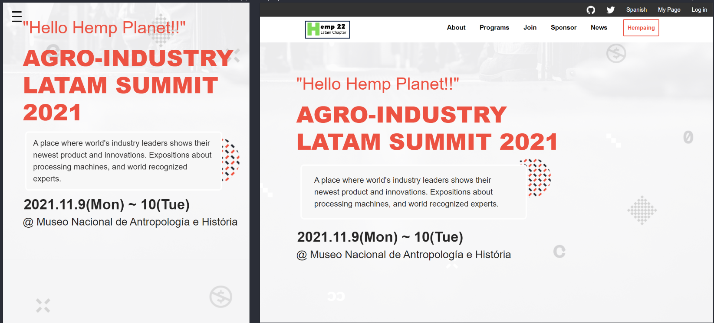

  # Capstone Module 1: Hemp Industries Submmit 2021

> This is the final project regading the firt module of Microverse program. 
> The main subjects that we intenselly worked on, were the three pilars of any 
> website on mobile or desktop devices, wich are HTML,CSS & JavaScript. I have to confess that, 
> even when I spare lots of hours reading the basics and some advanced features, It was 
> one of the biggest intellectual challengues I've been trough in all my live. I will enhance
> you to keep reading this document and find what I personally exprienced over the past 5 weeks
> of intense learning, lots of sleep depravation, frustrations and satisfactions over this period 
> of time. 

As I mentioned before, this is the final project of the module. We are applying all the skills we accordion-body adquired week over week on a variety of tasks and applied all of them in a project
with the major challenge to make it all in just one week. Languages,Frameworks,Technologies, and 
lots of so called professional or soft skills. It was awesome to work with people from all around
the world.

## Built With

- Major languages: HTML, CSS, JavaScript, GIT.
- Frameworks: Bootstrap 5, TypScript, NPM.
- Technologies used: GitHub, VScode, OpenAI, Linterns.

## Live Demo

[Live Demo Link](https://sergiogval.github.io/hemp-conference/)

## Getting Started

**This is an example of how you may give instructions on setting up your project locally.**
**Modify this file to match your project, remove sections that don't apply. For example: delete the testing section if the currect project doesn't require testing.**

To get a local copy up and running follow these simple example steps.

### Prerequisites

### Setup

### Install

### Usage

### Run tests

### Deployment

## Author

👤 **Sergio Valadez**

- GitHub: [@githubhandle](https://github.com/sergiogval)
- Twitter: [@twitterhandle](https://twitter.com/sgvldz)
- LinkedIn: [LinkedIn](https://linkedin.com/in/linkedinhandle)

## 🤝 Contributing

Contributions, issues, and feature requests are welcome!

Feel free to check the [issues page](../../issues/).

## Show your support

Give a ⭐️ if you like this project!

## Acknowledgments

👤 **Cindy Shin**

- Original design idea

## 📝 License

This project is [MIT](./MIT.md) licensed.
